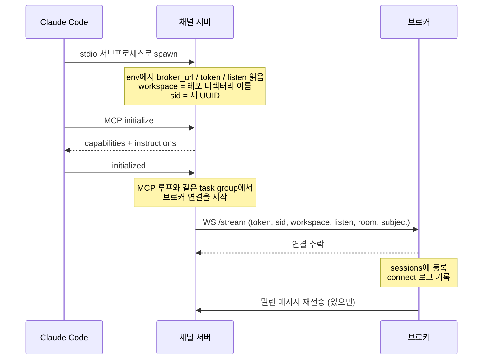
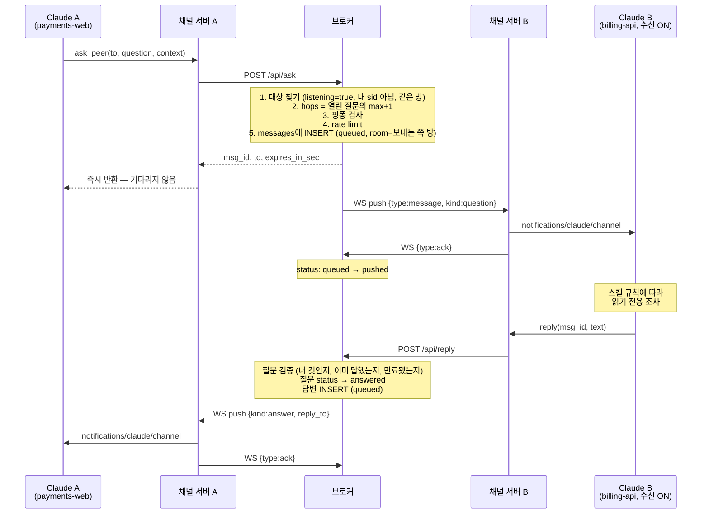
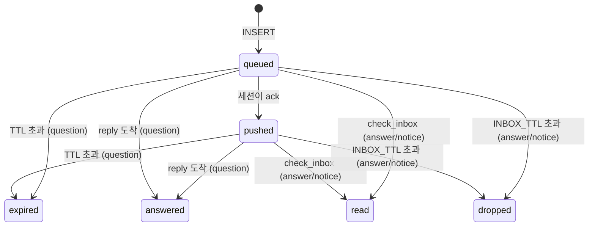

# 인프라 구조와 동작 구조

무엇이 어디서 돌고, 메시지 한 건이 어떤 경로로 흐르는지를 정리합니다.

왜 이렇게 설계했는지는 [ARCHITECTURE.md](ARCHITECTURE.md), 운영은 [OPERATIONS.md](OPERATIONS.md)를 보세요.

---

# 1부. 인프라 구조

## 배포 토폴로지

```
 개발자 머신 (N대)                          서버 (1대)
┌──────────────────────────┐
│ Claude Code 세션          │
│   └─ stdio ─┐            │              ┌──────────────────┐
│             ▼            │              │  리버스 프록시     │
│   peers 채널 서버 ────────┼── wss ──────▶│  nginx / ALB     │
│   (uv+python, 세션당 1개) │   outbound   │  :443            │
└──────────────────────────┘              └────────┬─────────┘
                                                   │ http (loopback)
┌──────────────────────────┐                       ▼
│ Claude Code 세션          │              ┌──────────────────┐
│   └─ stdio ─┐            │              │  broker          │
│             ▼            │              │  python, 단일 인스턴스│
│   peers 채널 서버 ────────┼── wss ──────▶│  :8080           │
└──────────────────────────┘   outbound   └────────┬─────────┘
                                                   │
                                          ┌────────▼─────────┐
                                          │ peers.db (SQLite)│
                                          │ tokens.json      │
                                          └──────────────────┘
```

**개발자 머신에는 인바운드 포트가 필요 없습니다.** 모든 연결이 브로커로 나가는 방향입니다. 노트북이 NAT 뒤에 있든 VPN을 오가든 상관없고, 방화벽 예외도 필요 없습니다. 푸쉬는 이미 열려 있는 WebSocket을 타고 거꾸로 내려옵니다.

## 프로세스 인벤토리

| 프로세스 | 어디서 | 몇 개 | 수명 |
|---|---|---|---|
| Claude Code | 개발자 머신 | 세션마다 1개 | 사용자가 켜고 끔 |
| peers 채널 서버 | 개발자 머신 | **Claude Code 세션마다 1개** | 부모 세션과 같음 |
| broker | 서버 | **정확히 1개** | 상시 |
| 리버스 프록시 | 서버 | 1개 | 상시 |

채널 서버는 Claude Code가 `uv run --script`로 stdio 서브프로세스를 띄웁니다. 세션을 3개 열면 채널 서버도 3개 뜨고, 브로커에는 3개의 세션으로 보입니다. 세션이 끝나 stdin이 닫히면 채널 서버도 스스로 종료합니다.

## 신뢰 경계

```
┌─ 신뢰하지 않음 ──────────────────────────────────┐
│  채널 메시지 본문                                  │
│  다른 사람의 Claude가 쓴 텍스트. 프롬프트 인젝션 경로  │
│  → 방어: 응답 세션의 도구 제한 (가장 확실)           │
└─────────────────────────────────────────────────┘

┌─ 부분 신뢰 ──────────────────────────────────────┐
│  채널 서버 (개발자 머신에서 돎)                      │
│  사용자가 고칠 수 있는 코드                          │
│  → 정책 판정을 여기 두지 않음. 전부 브로커가 강제      │
└─────────────────────────────────────────────────┘

┌─ 신뢰 ──────────────────────────────────────────┐
│  브로커                                          │
│  인증, 라우팅, 정책, 감사 기록의 단일 권위           │
└─────────────────────────────────────────────────┘
```

`hops` 값을 클라이언트가 보내지 않고 브로커가 계산하는 이유가 이 경계입니다. 채널 서버가 보낸 값을 믿으면 누구나 `hops: 0`으로 위조해 재질문 제한을 우회할 수 있습니다.

## 네트워크

| 구간 | 방향 | 프로토콜 | 비고 |
|---|---|---|---|
| Claude Code ↔ 채널 서버 | 양방향 | stdio (JSON-RPC) | **stdout은 MCP 전용.** 로그는 stderr로 |
| 채널 서버 → 프록시 | outbound | `wss` + `https` | 요청은 REST, 푸쉬는 WebSocket |
| 프록시 → 브로커 | loopback | `http` + `ws` | 브로커는 TLS를 하지 않음 |
| 브로커 → SQLite | 로컬 파일 | — | WAL 모드 |

WebSocket은 30초마다 브로커가 ping을 보내 살아 있는지 확인합니다. **프록시의 idle timeout이 30초보다 짧으면 연결이 계속 끊겼다 붙습니다.**

## 상태가 사는 곳

단일 인스턴스 제약의 근거가 여기 있습니다.

| 상태 | 어디 | 재시작하면 |
|---|---|---|
| presence (접속 세션 목록) | **메모리** (`dict[sid, Session]`) | 전부 사라짐 |
| rate limit 카운터 | **메모리** (`dict[key, list[timestamp]]`) | 0부터 다시 |
| 작업 요약 / listening 여부 | **메모리** (세션 객체) | 사라짐 |
| 방 목록 (`rooms`) | **메모리** (`dict[str, Room]`) | 사라짐, 세션이 재접속하며 복원 (아무도 없이 예약만 걸린 방은 유실) |
| 모든 메시지와 상태 | **디스크** (`messages` 테이블) | 그대로 남음 |
| 토큰 해시 | **디스크** (`tokens.json`) | 그대로 남음 |

presence가 메모리에 있으므로 **인스턴스를 2대 띄우면 서로 다른 인스턴스에 붙은 세션끼리는 보이지 않습니다.** 질문은 전달되지 않고, rate limit도 따로 셉니다.

메시지는 전부 디스크에 있으므로, 재시작 중에 오간 질문과 답변은 유실되지 않습니다. 세션이 다시 붙으면 밀린 것이 전달됩니다.

## 규모와 확장

세션 하나당 WebSocket 하나, 메모리 수 KB입니다. 수백 세션까지는 단일 인스턴스로 무리가 없습니다. 병목은 동시 접속 수가 아니라 SQLite 쓰기인데, 질문·답변 빈도를 생각하면 현실적으로 닿기 어렵습니다.

이중화가 필요해지면 순서는 이렇습니다.

1. `sessions` dict와 `push()`를 Redis pub/sub으로 옮긴다 — 어느 인스턴스에 붙었든 푸쉬가 도달하게
2. `hits` dict를 Redis로 옮긴다 — rate limit을 공유
3. SQLite를 Postgres로 바꾼다

1번만 해도 대부분 해결됩니다. 나머지는 규모가 더 커진 뒤의 일입니다.

---

# 2부. 동작 구조

## 세션이 뜨는 순간



**세션이 받을 준비가 되기 전에 푸쉬가 도착하면 조용히 사라집니다.** 브로커 연결과 MCP 루프를 같은 task group에서 돌리고, 세션이 끝나면 `cancel_scope`가 브로커 연결까지 함께 정리합니다.

`sid`는 채널 서버 프로세스마다 새로 만드는 UUID입니다. 세션을 다시 켜면 새 sid가 되고, 브로커는 `user@workspace`로 이전 세션과의 연속성을 판단합니다.

## 질문 한 건의 여정



`ask_peer`는 **즉시 반환됩니다.** 답을 기다리며 블로킹하지 않기 때문에, Claude A는 그동안 다른 작업을 계속합니다. 답은 나중에 채널 이벤트로 도착해 다음 턴에 처리됩니다.

## 메시지 상태 머신



`queued`는 "저장했지만 세션이 받았다는 확인이 없음"입니다. 세션이 오프라인이면 `push()`가 조용히 아무것도 하지 않고 `queued`로 남습니다 — 이게 재전달의 근거가 됩니다.

**행은 지워지지 않습니다.** `dropped`도 상태일 뿐이라 감사 기록은 그대로 남습니다. 디스크 정리는 운영자의 몫입니다.

## presence 수명주기

```
연결        sessions[sid] = Session(user, workspace, listening, ws, ...)
             │
             ├─ 같은 sid가 이미 있으면 → 이전 연결을 4001 replaced로 닫음
             │   (채널 서버는 4001을 보면 재연결하지 않음)
             │
30초마다     WebSocketResponse(heartbeat=30)이 ping을 보내고
             └─ pong이 없으면 그 연결을 닫는다
             │
끊김         del sessions[sid]
             └─ 단, 현재 등록된 객체와 같을 때만 삭제
                (새 연결이 이미 자리를 차지했으면 건드리지 않음)
```

마지막 조건이 없으면 경합이 생깁니다. 재연결이 빠르게 일어날 때 옛 연결의 close 이벤트가 새 세션을 지워버립니다.

## 만료 sweep

브로커가 `SWEEP_MS`(기본 15초)마다 두 가지를 합니다.

```
1. TTL 지난 질문 (queued 또는 pushed)
   → status = expired
   → 질문자에게 kind="notice" 푸쉬
   → 이후 그 질문에 reply하면 410

2. INBOX_TTL 지난 답변/알림 (queued 또는 pushed)
   → status = dropped
```

만료 알림은 브로커가 만드는 메시지라 `from_user`가 비어 있고, 채널 서버는 이를 `from: "broker"`로 표시합니다.

## 재연결과 재전달

여기에 **의도적인 비대칭**이 있습니다. 재연결 방식에 따라 무엇이 다시 오는지가 다릅니다.

| 상황 | 다시 오는 것 | 근거 |
|---|---|---|
| 같은 sid로 재연결<br/>(WS만 끊겼고 프로세스는 살아 있음) | **ack 못 받은 모든 메시지** (질문 포함) | `status = 'queued'`인 것 전부 |
| 새 sid, 같은 `user@workspace`<br/>(세션을 다시 켬) | **답변과 알림만** | 질문은 옮기지 않음 |

**질문이 새 세션으로 옮겨가지 않는 이유**는 이렇습니다. 질문은 "지금 살아 있는 특정 세션"을 보고 라우팅한 것입니다. 그 세션이 죽었다면 그 컨텍스트도 사라졌으므로, 새 세션에 떠넘기는 대신 TTL로 만료시키고 질문자에게 알리는 편이 정직합니다.

반대로 답변은 질문자가 기다리던 것이므로, 세션이 바뀌어도 같은 사람의 같은 레포라면 옮겨서 전달합니다. 옮길 때는 이전 세션이 정말 죽었는지 확인합니다 — 살아 있으면 건드리지 않습니다.

`check_inbox`는 세션이나 워크스페이스와 무관하게 **사용자 단위로** 조회합니다. 다른 레포에서 띄운 세션에서도 놓친 답변을 가져올 수 있습니다.

### 방은 헤더를 타고 따라온다

브로커는 매 접속마다 핸드셰이크 헤더로 `Session`을 **새로** 만듭니다. 즉 방 소속은 세션 객체에만 있고 재연결하면 헤더 값으로 다시 정해집니다. 그래서 채널 서버는 `join_room`이 성공하면 자기가 들고 있는 방 이름을 갱신하고, 헤더도 **재연결할 때마다** 다시 만듭니다. 이렇게 하지 않으면 프록시 idle timeout이나 브로커 재시작 한 번에 세션이 기동 시 방으로 조용히 되돌아가고, 상대는 옮긴 방에 남아 서로를 보지 못합니다.

## 실패하면 어떻게 되나

| 어디가 깨지면 | 증상 | 복구 |
|---|---|---|
| 브로커가 죽음 | 도구 호출이 전부 에러 | 채널 서버가 1초→30초 지수 백오프로 재연결. 메시지는 DB에 남아 있다가 재전달 |
| WebSocket만 끊김 | 푸쉬가 안 옴 | 같은 sid로 재연결 → ack 못 받은 것 재전송 |
| 세션이 종료됨 | 그 세션 앞 질문은 방치 | TTL 만료 후 질문자에게 notice |
| 답변 도착 시 질문자가 오프라인 | `delivered_live: false` | `queued`로 남았다가 재접속 시 전달, 또는 `check_inbox` |
| 채널 서버가 기동 실패 | `claude mcp list`에 `CONNECTION_CLOSED` | `uv` 설치 여부 확인. 실패는 약 15분 캐시됨 |
| 세션이 채널로 등록 안 됨 | 도구는 되는데 푸쉬가 안 옴 | `--channels` 태그 확인. 채널 서버는 이를 알 방법이 없음 |
| 프록시 idle timeout | connect/disconnect 반복 | timeout을 ping 주기(30초)보다 길게 |

마지막에서 두 번째가 이 시스템의 가장 조용한 실패입니다. 그래서 질문 수신을 `PEERS_LISTEN=1`로 **명시적으로 켜게** 만들었습니다. 도착하지 않을 곳으로 질문을 보내는 것보다는, 받겠다고 선언한 세션에만 보내는 편이 낫습니다.
